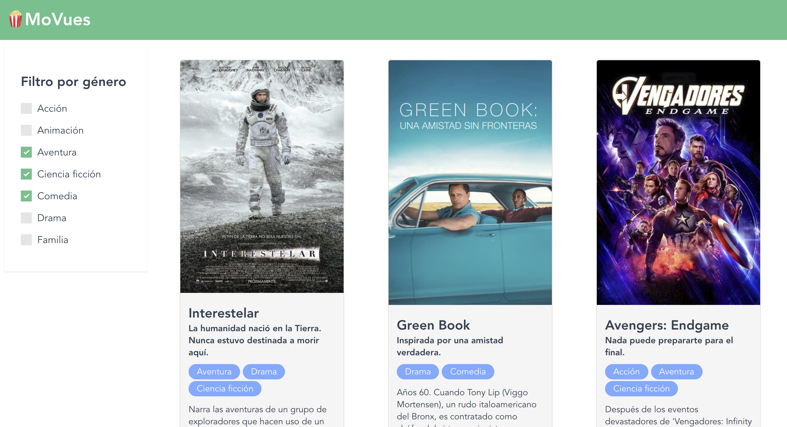

# 🍿 MoVues

Aplicación funcional en VueJS.



## Project setup
```
npm install
```

### Compiles and hot-reloads for development
```
npm run serve
```

## Créditos
[Idea basada en VUE-POKEDEX by Rubén Valseca](https://github.com/rubnvp/vue-pokedex)

### Gracias a la ayuda de:
* Rubén Valseca [@rubnvp](https://twitter.com/rubnvp)
* Pepe García [@pepeloper_](https://twitter.com/pepeloper_)

Maravillosos los checkboxs by 
[Kenan Yusuf](https://codepen.io/KenanYusuf/pen/PZKEKd)